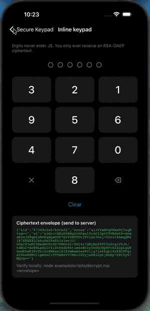

# expo-secure-keypad-jsi

English: [README.md](../README.md)

Expo 앱용 보안 키패드. 숫자 PIN 패드(`'digit'`)와 QWERTY 키보드(`'full'`)를
제공합니다. 사용자가 입력한 값은 JavaScript 런타임에 들어오지 않습니다. 터치는
네이티브 뷰가 처리하고, 입력값은 `mlock`으로 잠긴 C++ 버퍼에 쌓인 뒤 서버 공개키로
RSA-OAEP 암호화되어 **암호문만** JS로 전달됩니다.

<p align="center">
  
  <br>
  <em>예제 앱의 셔플된 PIN 패드 (iOS)</em>
</p>

## 기능

- 터치 좌표와 키 값의 매핑이 네이티브에만 존재합니다. JS는 셔플된 배치를 알 수 없습니다.
- 입력값은 `mlock`된 C++ 버퍼에 보관되고 사용 직후 `OPENSSL_cleanse`로 소거됩니다.
- RSA-OAEP(SHA-256)로 암호화된 암호문만 JS로 전달됩니다.
- 암호문에 `kid`, `nonce`, `timestamp`가 포함되어 서버가 키 오설정과 재전송을 검출할 수 있습니다.
- 앱이 백그라운드로 가거나 뷰가 창에서 분리되면 버퍼를 소거하고 JS에 카운트 0을 알립니다. 끄는 옵션이 없는 무조건적 동작이라, 입력 중이던 PIN이 앱 전환을 넘겨 살아남지 않습니다.
- Android에서 가려진 창을 통한 터치(탭재킹)를 거부합니다.

## 범위 밖 (Non-goals)

이 라이브러리는 입력값이 JS 런타임에 노출되지 않게 하는 것만 다룹니다.
[위협 모델](#위협-모델)에 정리되어 있습니다.

## 요구 사항

Expo SDK 54+, React Native 0.81+, New Architecture 전용

## 설치

```sh
pnpm expo install expo-secure-keypad-jsi

# 개발 빌드. `expo run:*`이 pod install까지 수행합니다.
pnpm expo run:ios        # 또는: pnpm expo run:android
```

## 사용법

```tsx
import { SecureKeypad } from 'expo-secure-keypad-jsi';
import { useState } from 'react';

export function PinScreen({ serverPublicKeyPem }: { serverPublicKeyPem: string }) {
  const [count, setCount] = useState(0);

  return (
    <SecureKeypad
      publicKey={serverPublicKeyPem}       // RSA-2048 이상, PEM (SubjectPublicKeyInfo)
      minLength={6}
      maxLength={6}
      shuffle="mount"
      autoSubmit
      onDigitCountChanged={setCount}        // 마스킹 표시용
      onComplete={(ciphertext) => {
        fetch('/api/verify-pin', { method: 'POST', body: ciphertext });
      }}
      onError={(e) => console.warn(e.phase, e.code)}
    />
  );
}
```

### Props

| Prop | 타입 | 기본값 | 설명 |
|---|---|---|---|
| `publicKey` | `string` | 필수 | RSA 2048~8192bit PEM. 약한 키는 거부 |
| `keypadType` | `'digit' \| 'full'` | `'digit'` | `'full'`은 QWERTY 키보드 |
| `minLength` / `maxLength` | `number` | `4` / `6` (digit), `4` / `64` (full) | 유효 범위는 digit 4~12, full 4~64. 범위 밖의 **prop 값**은 범위 안으로 조정됩니다(digit에 `maxLength={20}`을 주면 12로 동작). `minLength`가 `maxLength`보다 크면 `maxLength`로 낮춥니다. 입력이 `maxLength`에 도달하면 이후 키 입력은 오류 없이 무시됩니다 |
| `shuffle` | `'mount' \| 'perKey' \| 'off'` | `'mount'` | 배치 셔플 시점 |
| `autoSubmit` | `boolean` | `true` (digit), `false` (full) | `maxLength` 도달 시 자동 암호화 |
| `theme` | `KeypadTheme` | [테마](#테마) 참조 | 색상, 모서리 반경, 글자 크기 |
| `accessory` | `ReactNode` | | 키패드 바로 위에 렌더링할 React 요소. 키패드가 입력 필드를 가리는 경우(바텀시트 등) 마스킹 표시나 확인 버튼을 두는 자리 |
| `style` | `StyleProp<ViewStyle>` | [크기](#크기) 참조 | 키패드에 적용. `accessory`가 있으면 컨테이너에 적용 |

### 접근성

**이 키패드는 양 플랫폼 모두 스크린리더를 지원하지 않습니다.**
Android의 `AccessibilityService`가 다른 앱의 노드 트리와 입력 이벤트를 읽을 수 있는 표준 키로깅 경로이고, 앱이 진짜 스크린리더와 악성 서비스를 구분할 수 없기 때문입니다.
스크린리더 사용자를 지원해야 한다면 별도의 입력 경로를 제공하십시오.

### 이벤트

| 이벤트 | 인자 | 설명 |
|---|---|---|
| `onComplete` | `string` | 암호문 JSON. 서버로 전송 |
| `onDigitCountChanged` | `number` | 현재 입력 길이 |
| `onError` | `{ code, phase }` | `phase`: `'arm'`(공개키 거부), `'submit'`(암호화 실패), `'input'`(Android가 가려진 창을 통한 터치를 거부, `code`는 `ERR_OBSCURED_TOUCH`) |

`'input'` 오류는 위협 탐지가 아니라 안내용입니다. 화면 필터 같은 오버레이 앱이 켜져
있으면 Android가 터치를 조용히 버리므로, 키패드가 반응하지 않는 이유를 사용자에게
알릴 때 사용합니다.

ref API: `clear()`, `submit()`

예제: [InlineDemo](../example/demos/InlineDemo.tsx),
[FullKeyboardDemo](../example/demos/FullKeyboardDemo.tsx),
[AccessoryDemo](../example/demos/AccessoryDemo.tsx),
[BottomSheetDemo](../example/demos/BottomSheetDemo.tsx)

### QWERTY 키보드 (`keypadType: 'full'`)

영문 대소문자, 숫자, 특수문자 32종(``!@#$%^&*()-_=+[]{}\|;:'",.<>?/`~``)을 입력하는
비밀번호용 키보드입니다. 공백은 받지 않습니다.

- 배치: 숫자 행 / `qwertyuiop` / `asdfghjkl` / `⇧ zxcvbnm ⌫` / `[!#1] [✕] [⏎]`.
  `!#1`이 기호 레이어로 전환
- 셔플: 자판은 표준 QWERTY를 유지하고 숫자 행만 완전 셔플, 문자 행마다 빈 더미 키
  1개를 무작위 위치에 삽입. `'perKey'`는 매 입력 후 재추첨
- shift: 한 글자 후 해제, 더블탭으로 caps lock. shift 상태와 레이어는 네이티브에만 존재
- 제출: 가변 길이라 `autoSubmit` 기본값이 `false`이고 `⏎` 키가 제출
- 키 확대 미리보기는 화면 녹화에 입력이 드러나므로 지원하지 않음

### 테마

색상은 모두 `#RRGGBB` 또는 `#RRGGBBAA`입니다(알파가 마지막, 양 플랫폼 동일 해석.
색 이름은 거부). 크기는 밀도 독립 단위(Android dp, iOS pt)라 같은 값이면 양쪽이 같게
보입니다.

| 필드 | 타입 | 기본값 | 설명 |
|---|---|---|---|
| `keyColor` | `string` | `#1C1C1E` | 키 배경 |
| `keyTextColor` | `string` | `#FFFFFF` | 숫자·문자 글리프 |
| `actionTextColor` | `string` | `#8E8E93` | 기능 키(`⌫`, `✕`, `⇧`, `!#1`, `⏎`) |
| `cornerRadius` | `number` | `12` (digit), `8` (full) | 키 모서리 반경 |
| `digitTextSize` | `number` | `32` | 글리프 기준 크기. 이름과 달리 `keypadType: 'full'`에도 적용됩니다. 키 종류마다 이 값에 배율이 걸립니다 — 숫자 키 1배, 기능 키 0.7배, QWERTY의 문자 0.6배·기능 키 0.5배. 배율은 양 플랫폼이 동일 |
| `pressedHighlight` | `boolean` | `true` | 누르고 있는 키를 불투명도 70%로 흐리게 표시. `false`면 눌림 표시를 끔 |
| `fontFamily` | `string` | 시스템 폰트 | 숫자·문자 글리프의 폰트. 플랫폼이 이미 해석할 수 있는 이름이면 됩니다 — `expo-font`(`useFonts` / `loadAsync`)로 등록한 패밀리, 빌드 시 번들한 폰트, 시스템 패밀리. 해석 실패 시 예외 없이 시스템 폰트로 폴백합니다 |

`fontFamily`는 값에서 나온 글리프(숫자·문자·기호)에만 적용됩니다. 기능 키 글리프
(`⌫`, `✕`, `⇧`, `⏎`)는 항상 시스템 폰트로 그립니다 — 커스텀 폰트에는 이 글리프가
없는 경우가 대부분이고, 없으면 라벨 없는 키에 두부(□)가 찍히기 때문입니다.
`keypadType: 'full'`이면 출력 가능한 ASCII 전체(0x21~0x7E)를 덮는 폰트를 골라야
합니다. 그렇지 않으면 일부 키가 두부로 보입니다. 동작하는 예제는
`example/demos/FontDemo.tsx`(expo-font 패밀리 2종)에 있습니다.


### 크기

높이, `flex`, `aspectRatio` 중 아무것도 주지 않으면 digit은 `aspectRatio: 3/4`,
full은 `4/3`이 적용됩니다. Fabric은 스타일로만 크기를 정하므로 이 기본값은 JS 래퍼가
넣습니다. 저수준 `SecureKeypadJsiView`를 직접 쓴다면 크기를 직접 지정해야 합니다.

`accessory`를 주면 `style`은 accessory와 키패드를 감싸는 컨테이너에 적용되고,
키패드는 accessory가 차지한 나머지 공간을 채웁니다. `accessory`는 일반 React 요소이며
입력값을 받지 않습니다. 표시할 수 있는 것은 `onDigitCountChanged`로 받은 길이뿐입니다.

```tsx
<SecureKeypad
  publicKey={pem}
  style={{ height: 380 }}
  accessory={<Text style={styles.mask}>{'●'.repeat(count)}</Text>}
  onDigitCountChanged={setCount}
/>
```

## 서버 복호화

`onComplete`로 받는 JSON입니다.

```json
{ "kid": "97349c2e876fcbf2", "nonce": "…base64…", "ct": "…base64…" }
```

- `kid`: 공개키 식별자. 서버가 키 오설정을 진단하는 용도
- `nonce`: 복호화 전에 재전송을 걸러내는 용도. 평문 안의 nonce와 일치해야 함
- `ct`: RSA-OAEP(SHA-256, MGF1-SHA256) 암호문. RSA-2048이면 256바이트

알고리즘과 버전 필드는 의도적으로 없습니다. 암호문 밖의 값은 위변조가 가능하므로
서버는 알고리즘을 고정해 두고, 버전은 복호화한 평문에서 확인합니다.

`ct`를 복호화하면 96바이트 고정 평문이 나옵니다. `'digit'`과 `'full'`은 같은 구조입니다.

| 오프셋 | 크기 | 필드 | 설명 |
|---|---|---|---|
| 0 | 2 | magic `"SK"` | 고정값. 이 라이브러리가 만든 평문이 맞는지 확인 |
| 2 | 1 | version = 2 | 이 96바이트 레이아웃의 버전. 모르는 값이면 거부 |
| 3 | 1 | secretLength (4~64) | 실제 입력 길이. 뒤의 secret을 자르는 기준 |
| 4 | 64 | secret (ASCII, 0 패딩) | 입력값. printable ASCII(0x21~0x7E), 남는 자리는 0 |
| 68 | 16 | nonce | 1회용 난수. 봉투 바깥 `nonce`와 일치해야 함 |
| 84 | 8 | timestamp (unix 초, 빅엔디안) | 암호화 시각. 신선도 검사용 |
| 92 | 4 | reserved | 항상 0. 다음 버전용 확장 자리 |

Node 예시 (전체 구현: [decrypt.mjs](../example/scripts/decrypt.mjs)):

```js
import crypto from 'node:crypto';

const msg = JSON.parse(body);
const plain = crypto.privateDecrypt(
  { key: privateKeyPem,
    padding: crypto.constants.RSA_PKCS1_OAEP_PADDING,
    oaepHash: 'sha256' },
  Buffer.from(msg.ct, 'base64')
);
if (plain.subarray(0, 2).toString() !== 'SK' || plain[2] !== 2) throw new Error('bad payload');
const secret = plain.subarray(4, 4 + plain[3]).toString('ascii');
const nonce = plain.subarray(68, 84).toString('base64');
const timestamp = Number(plain.readBigUInt64BE(84));
```

서버가 해야 할 검증:

- magic과 version 확인
- `nonce` 중복 거부(재전송 차단), JSON의 `nonce`와 평문의 nonce 일치 확인
- `timestamp` 신선도 확인(예: ±10분)
- 검증 후 평문 비밀값 즉시 소거

로컬 확인:

```sh
node example/scripts/gen-keys.mjs          # 데모 키쌍 생성, 공개키를 example/demos/demoKey.ts에 넣기
node example/scripts/decrypt.mjs '<JSON>'  # 앱 화면에 표시된 암호문 JSON 복호화
```

## 구조

| 계층 | Android | iOS |
|---|---|---|
| 렌더링 | Kotlin `View` + Canvas (TextView 없음) | Swift `UIView` + CoreGraphics (UILabel 없음) |
| 브릿지 | JNI → C ABI | Objective-C++ → C ABI |
| 코어 | 공유 C++ (`common/`) | 동일 |
| 암호화 | OpenSSL 3.6.2 (`openssl-static` prefab 3.6.2-2, 정적 링크) | OpenSSL 3.6.2 (`OpenSSL-Universal` 3.6.2000 고정) |

#### 실기기 메모리 측정

키패드로 비밀값을 입력한 뒤, 프로세스의 상주 읽기·쓰기 메모리 전체에서 그 값을
검색했습니다. 빌드는 배포와 동일한 최적화 수준이고 디버거 접속만 추가했습니다.

대조군으로 React state에 넣어둔 평범한 JS 문자열은 같은 검색에서 46개(iOS)·47개(Android)가
검출됐습니다. 아래 `length_=0`이 "없다"는 측정이지 "스캐너가 아무것도 못 읽었다"가 아니라는
뜻입니다.

```
# Android — /proc/<pid>/mem 으로 읽은 버퍼 페이지
SecureBuffer  page_=0x7aede5c000  pageSize_=4096  length_=12  locked_=1

입력 직후        71 76 7a 78 6d 6c 70 67 77 6b 68 64 00 00 00 00 ...
                 b'qvzxmlpgwkhd\x00\x00\x00\x00 ...'
제출 후          00 00 00 00 00 00 00 00 00 00 00 00 00 00 00 00 ...   length_=0
백그라운드 전환 후  00 00 00 00 00 00 00 00 00 00 00 00 00 00 00 00 ...   length_=0
```

```
# iOS — 같은 페이지를 lldb 로 읽은 결과
SecureBuffer  page_=0x10cb88000  pageSize_=16384  length_=12  locked_=1

입력 직후        page content: b'qvzxmlpgwkhd'
제출 후          page content: b''                                      length_=0
백그라운드 전환 후  page content: b''                                      length_=0

# 버퍼 페이지의 속성 — 독립된 읽기·쓰기 익명 영역이고 변경된 페이지는 1개뿐입니다.
# 별도 실행에서 확인한 것이라 주소는 위와 다릅니다 (매 실행 재배치)
(lldb) memory region 0x102b64000
[0x0000000102b64000-0x0000000102b68000) rw-
Dirty pages: 0x102b64000.
```

## 위협 모델

| 위협 | 방어 | 방법 / 사유 |
|---|---|---|
| JS 힙 덤프, Hermes 스냅샷 | O | 입력값이 JS VM에 진입하지 않음 |
| 브릿지·JSI 트래픽 스니핑 | O | 키 매핑과 입력값이 네이티브에만 존재 |
| Layout Inspector, 접근성 트리 스크래핑 | O | 글리프 직접 렌더, 텍스트 노드 없음. 중요하지 않은 뷰까지 요청하는 서비스에는 텍스트 없는 키패드 노드(위치·크기)만 보임 |
| 유저랜드 메모리 스캔 | 대체로 O | cleanse는 항상, mlock은 성공 시. 입력값 수명 마이크로초. libcrypto 내부 일시 사본은 존재 |
| 스왑 누출 | 조건부 O (Android) | mlock + MADV_DONTDUMP. `RLIMIT_MEMLOCK`이 작은 기기에서 mlock이 실패하면 조용히 cleanse만 남음. iOS는 RAM 압축이라 해당 없음 |
| 암호문 재전송 | O (서버 협조 시) | nonce + timestamp를 서버가 검증 |
| 탭재킹, 오버레이 | 부분 (Android) | `filterTouchesWhenObscured`로 입력 거부 |
| 스크린샷, 화면 녹화 | X | 입력값은 렌더되지 않으나 눌림 하이라이트가 위치를 남김. 캡처 차단은 앱 몫, 어려우면 `pressedHighlight: false` |
| 후킹, 디버거 | X | RASP 영역 |
| 루팅·탈옥 기기 | X | RASP, 서버 어테스테이션 영역 |
| JS 번들 변조로 공개키 바꿔치기 | X | 방어선은 OTA 코드 사이닝 |
| 서버 개인키 유출 후 과거 트래픽 복호화 | X | RSA-OAEP는 forward secrecy 없음. 키 로테이션 권장 |
| OS 키로거, 커널 침해, 하드웨어 공격 | X | 앱 권한 밖 |


## 라이선스

MIT — [LICENSE](../LICENSE) 참조.
